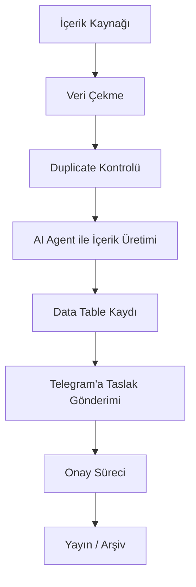
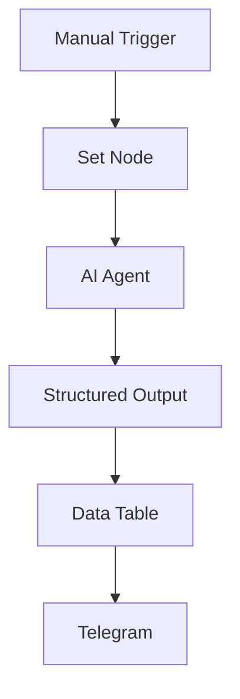
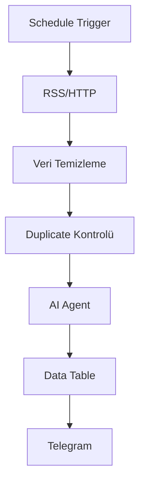
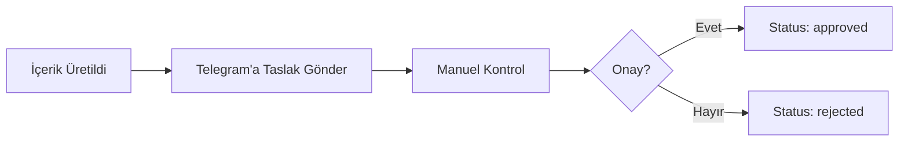

# Akış Şeması

## Sistem Genel Akışı

```mermaid
flowchart TD
    A[İçerik Kaynağı] --> B[Veri Çekme]
    B --> C[Duplicate Kontrolü]
    C --> D[AI Agent ile İçerik Üretimi]
    D --> E[Data Table Kaydı]
    E --> F[Telegram'a Taslak Gönderimi]
    F --> G[Onay Süreci]
    G --> H[Yayın / Arşiv]
```

## Workflow 1 — Manuel İçerik

```mermaid
flowchart TD
    A[Manual Trigger] --> B[Set Node]
    B --> C[AI Agent]
    C --> D[Structured Output]
    D --> E[Data Table]
    E --> F[Telegram]
```

## Workflow 2 — Kaynaktan İçerik

```mermaid
flowchart TD
    A[Schedule Trigger] --> B[RSS/HTTP]
    B --> C[Veri Temizleme]
    C --> D[Duplicate Kontrolü]
    D --> E[AI Agent]
    E --> F[Data Table]
    F --> G[Telegram]
```

## Onay Süreci (İlk Aşama)

```mermaid
flowchart LR
    A[İçerik Üretildi] --> B[Telegram'a Taslak Gönder]
    B --> C[Manuel Kontrol]
    C --> D{Onay?}
    D -->|Evet| E[Status: approved]
    D -->|Hayır| F[Status: rejected]
```
