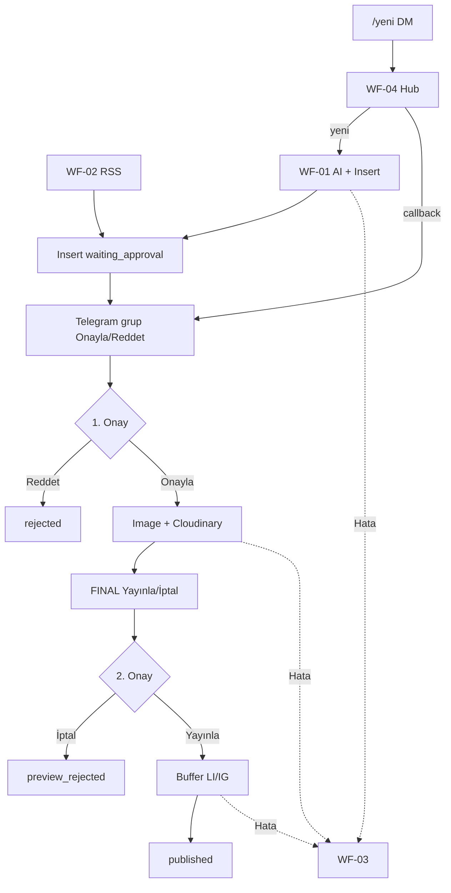
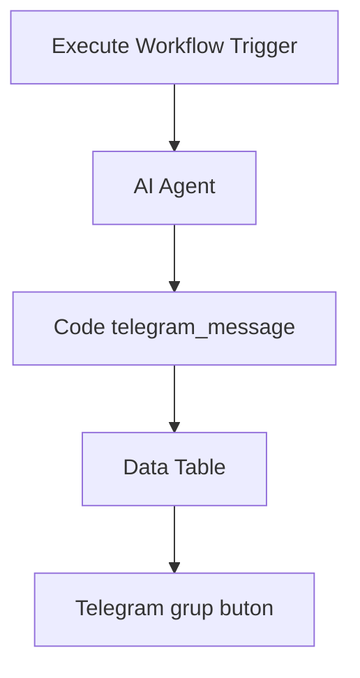
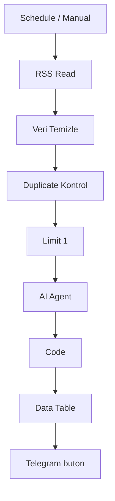
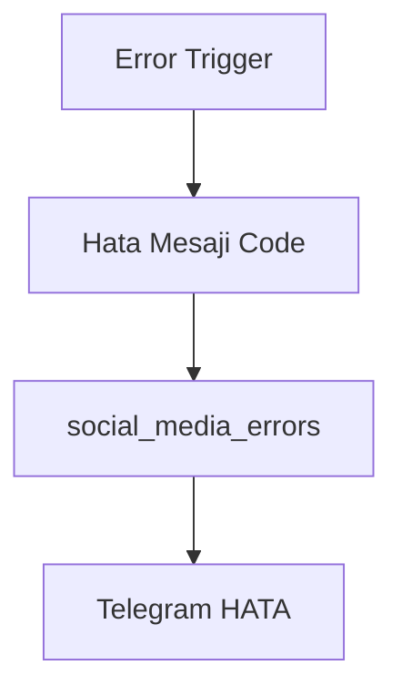
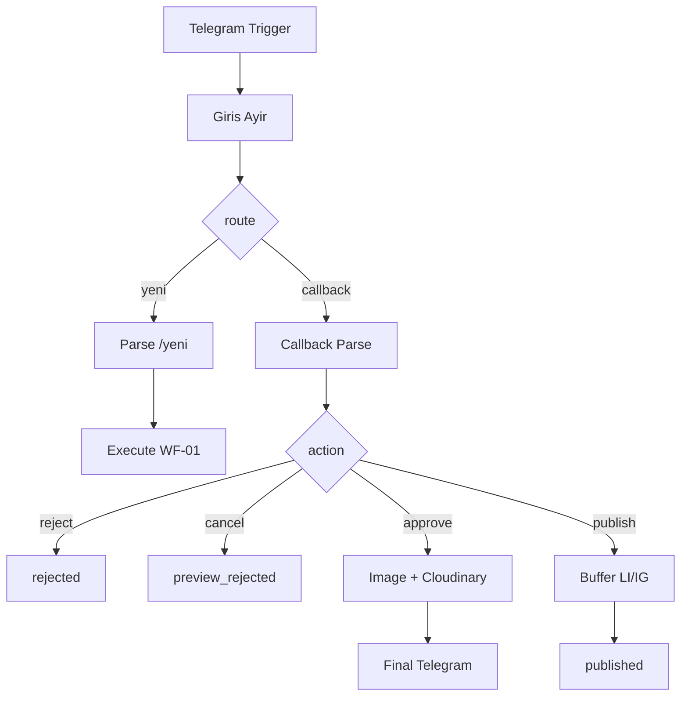
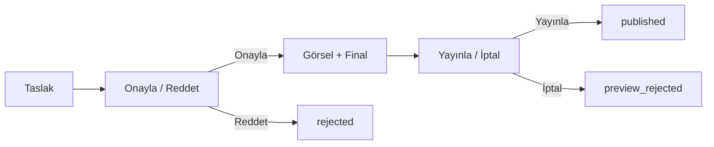

# Akış Şeması

## Sistem Genel Akışı

## Workflow 1 — Manuel (`/yeni` → Execute)

## Workflow 2 — Kaynaktan İçerik

## Workflow 3 — Error Handling

## Workflow 4 — Telegram Hub

## 2 Kademeli Onay

