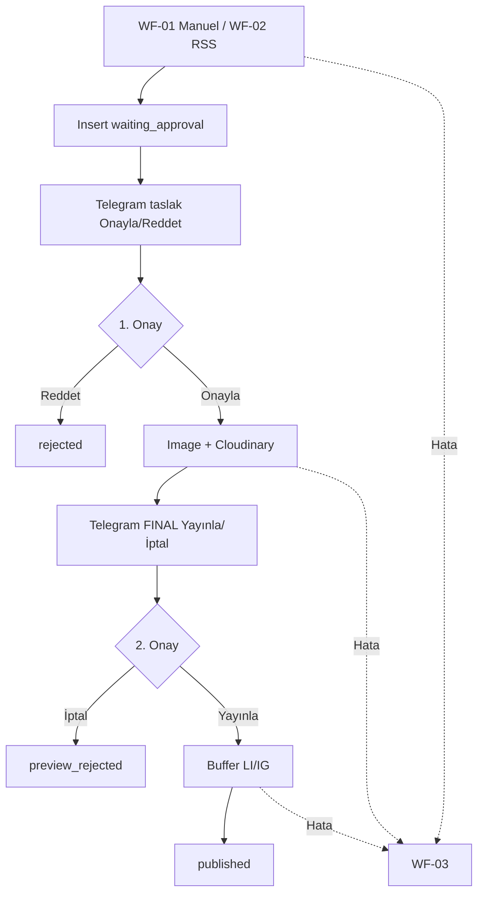
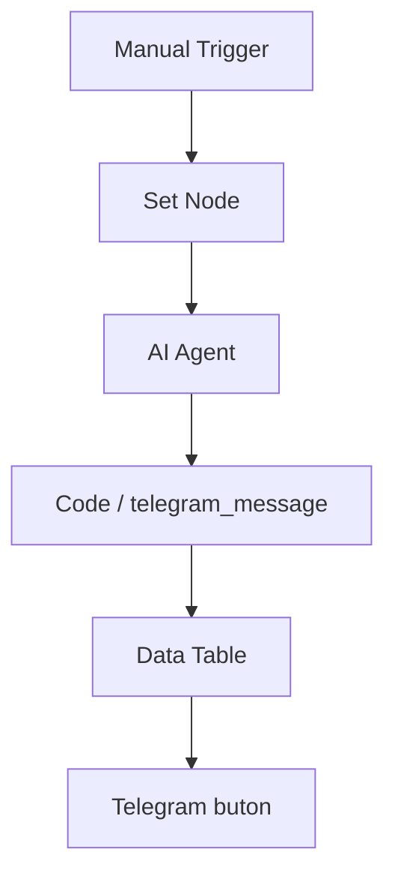
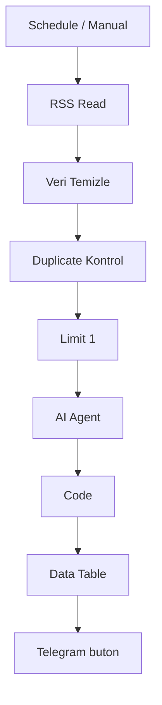
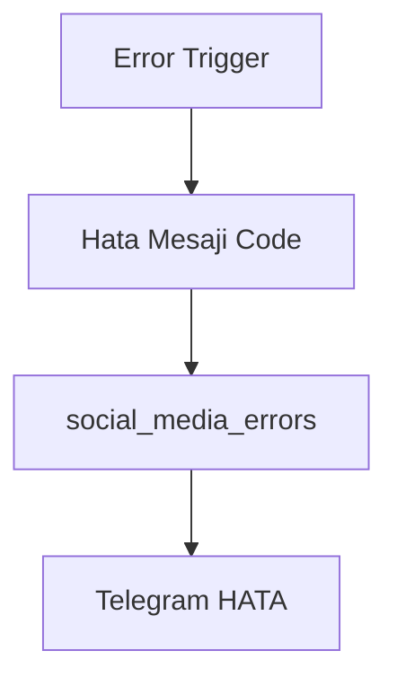
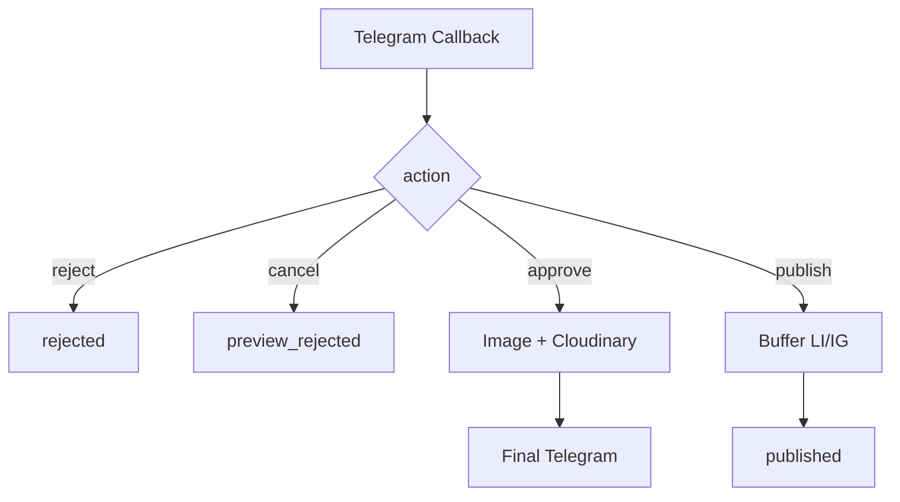
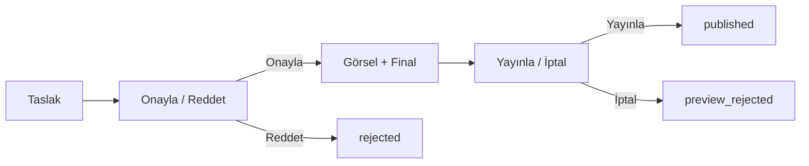

# Akış Şeması

## Sistem Genel Akışı

## Workflow 1 — Manuel İçerik

## Workflow 2 — Kaynaktan İçerik

## Workflow 3 — Error Handling

WF-01, WF-02, WF-04 → Error Workflow = WF-03.

## Workflow 4 — Onay + Görsel + Yayın

## 2 Kademeli Onay

